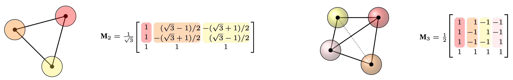

# [$\textup{O}n$ Learning Deep $\textup{O}(n)$-Equivariant Hyperspheres](https://arxiv.org/abs/2305.15613)

<!-- Add assets/figure.png -->

The official implementation of the ["$\textup{O}n$ Learning Deep $\textup{O}(n)$-Equivariant Hyperspheres"](https://arxiv.org/abs/2305.15613) paper, accepted to ICML 2024



**Authors:** Pavlo Melnyk, Michael Felsberg, Mårten Wadenbäck, Andreas Robinson, Cuong Le

[[arXiv]](https://arxiv.org/abs/2305.15613) [[bibtex]](https://github.com/pavlo-melnyk/equivariant-hyperspheres#Citation)

This repository borrows the organisation and experimental setup code from https://github.com/DavidRuhe/clifford-group-equivariant-neural-networks.

## Abstract
In this paper, we utilize hyperspheres and regular $n$-simplexes and propose an approach to learning deep features equivariant under the transformations of $n$D reflections and rotations, encompassed by the powerful group of O($n$). 
Namely, we propose O($n$)-equivariant neurons with spherical decision surfaces that generalize to any dimension n, which we call Deep Equivariant Hyperspheres. We demonstrate how to combine them in a network that directly operates on the basis of the input points and propose an invariant operator based on the relation between two points and a sphere, which as we show, turns out to be a Gram matrix. Using synthetic and real-world data in nD, we experimentally verify our theoretical contributions and find that our approach is superior to the competing methods for O(n)-equivariant benchmark datasets (classification and regression), demonstrating a favorable speed/performance trade-off.

## Requirements and installation 
(the versions used for the experiments)

- Python 3.9.15
- torch 1.12.1+cu113
- PyYAML 6.0
- scikit-learn 1.1.3
- h5py 3.7.0
- tqdm 4.64.1

## Theory demo
Have a look at `notebooks/equivariant_hyperspheres_demo.ipynb` for a gentle introduction to the core theory presented in our paper.

## Code organization
- `configs/`: Contains the configuration files.
- `data/`: Contains the data loading scripts.
- `engineer/`: Contains the training and evaluation scripts.
- `models/`: Contains model (`deepspheres.py`) and layer (`hyperspheres.py`) implementations.
- `notebooks/`: Contains the theory demo notebook.
- `log-<experiment_name>`: Contains checkpoints of the models from respective experiments.

## Usage and datasets
Before running the experiments:

- Set a DATAROOT environment variable: `export DATAROOT=./datasets/`.
- **Make sure** to select the correct experiment dir for logging as `self.dir` in `ConsoleLogger` in `loggers/loggers.py`.

<!-- For the convex hull experiments, run `data/hulls.py` to generate the data. -->

## Experiments 
(To only evaluate, uncomment the appropriate lines in `/configs/engineer/trainer.yaml` and then) Run:

### O(3) Action recognition (Skeletons)
```python o3_skeletons.py -C configs/engineer/trainer.yaml -C configs/optimizer/adam.yaml -C configs/dataset/skeletons.yaml -C configs/model/o3_deh_skeletons.yaml --seed=1 --trainer.max_steps=72000 --trainer.val_check_interval=1000 --dataset.batch_size=32 --optimizer.lr=0.001```
(See `o3_skeletons.py` for more options.)


### O(5) Regression
```python o5_regression.py -C configs/engineer/trainer.yaml -C configs/optimizer/adam.yaml -C configs/dataset/o5_regression.yaml -C configs/model/o5_deh_reg.yaml --trainer.max_steps=131072 --trainer.val_check_interval=1024 --dataset.batch_size=32 --dataset.num_samples=30000 --optimizer.lr=0.001```


### O(5) Convex hulls
```python hulls.py -C configs/engineer/trainer.yaml -C configs/optimizer/adam.yaml -C configs/dataset/hulls.yaml -C configs/model/o5_deh_hull.yaml --trainer.max_steps=131072 --trainer.val_check_interval=1024 --dataset.batch_size=128 --dataset.num_samples=65536 --optimizer.lr=0.001```


## Citation
Please cite in case you find the code/paper useful:
```
@article{melnyk2024onlearning,
  title={{O$n$ Learning Deep O($n$)-Equivariant Hyperspheres}},
  author={Melnyk, Pavlo and Felsberg, Michael and Wadenb{\"a}ck, M{\aa}rten and Robinson, Andreas and Le, Cuong},
  journal={arXiv preprint arXiv:2305.15613},
  year={2024}
}
```